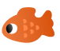
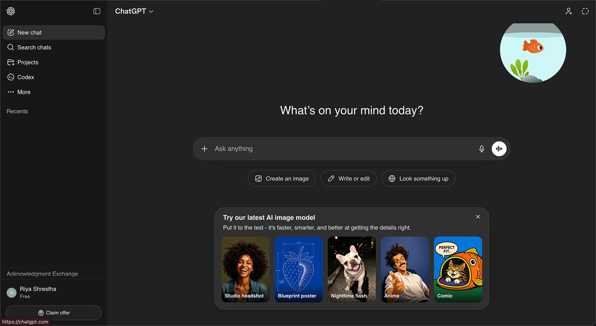

 
<h1>Keep Guppy Alive!</h1>

Guppy is a virtual pet fish that lives in your ChatGPT tab inside a bowl. The bowl represents ChatGPT's water consumption. Every prompt drops the bowl's water level and leaves Guppy panicking. It is your job to make sure you can keep Guppy alive whether that is by shortening your prompts or not using ChatGPT at all.

<h2>How it works</h2>
 
<ul>
  <li>Guppy lives in your browser as a Chrome extension popup</li>
  <li>Its water level is calculated based on the number of characters in each prompt you send</li>
  <li>The longer the prompt, the more water it loses</li>
  <li>The goal is to keep it alive</li>
</ul>

<h2>Backstory</h2>

The idea came to me during my Typography and Interaction class at Parsons. We were talking about AI and how we often don't know about its cost on the environment. My professor explained this in terms of water tanks and how each one of us has a water tank of servers can use to cool it. This made me wonder, what if we could actually see those water tanks? And so the fish bowl was born.

<h2>Design</h2>

For the design, I wanted the user to form an attachment with the little goldfish Guppy — a desire to take care of him — with the hope that it translates into a desire to take care of the ocean.

What is interesting about this project is the number of times I ran out of free ChatGPT usage while testing whether the code worked, which is ironic, considering my goal was to make users keep the fish alive.

<h2>Installation</h2>

<ol>
  <li>Clone this repository</li>
  <li>Open Chrome and go to <code>chrome://extensions</code></li>
  <li>Enable <strong>Developer mode</strong> in the top right</li>
  <li>Click <strong>Load unpacked</strong> and select the project folder</li>
  <li>Guppy will appear in your extensions bar</li>
</ol>

                      
